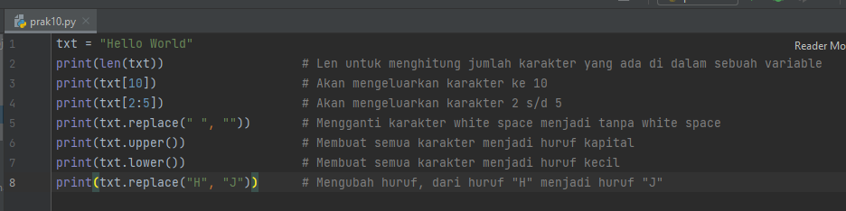
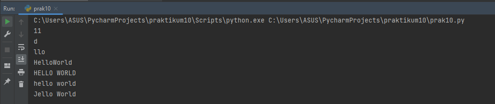
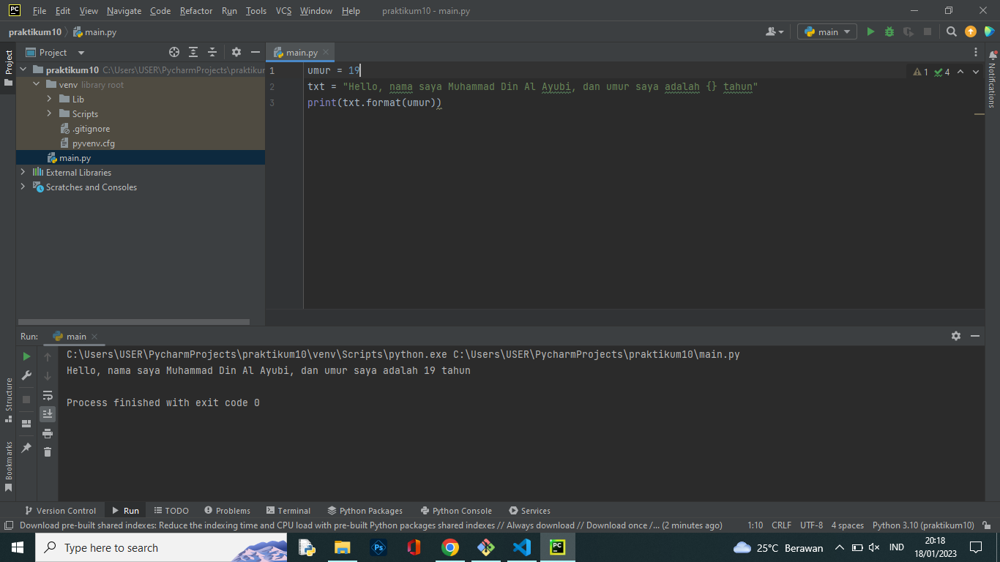

# praktikum 10

# Nama : Muhammad Din Al Ayubi
# Kelas : TI.22.A.3
# NIM : 312210293

## Tugas mengerjakan latihan sederhana, sebagai berikut :
# Tugas 1
## Input :

## Dengan Penjelasan sederana diatas maka akan mendapatkam output berupa

# Tugas 2
## Menegerjakan latihan soal dengan melengkapi kode sederhana agar mendapatkan output yang sesuai, dengan menambahakan kode {} maka kode dapat dijalankan tanpa masalah

# Sekian tugas yang kali ini saya dapat sampaikan kurang lebihnya mohon maaf, Terima Kasih